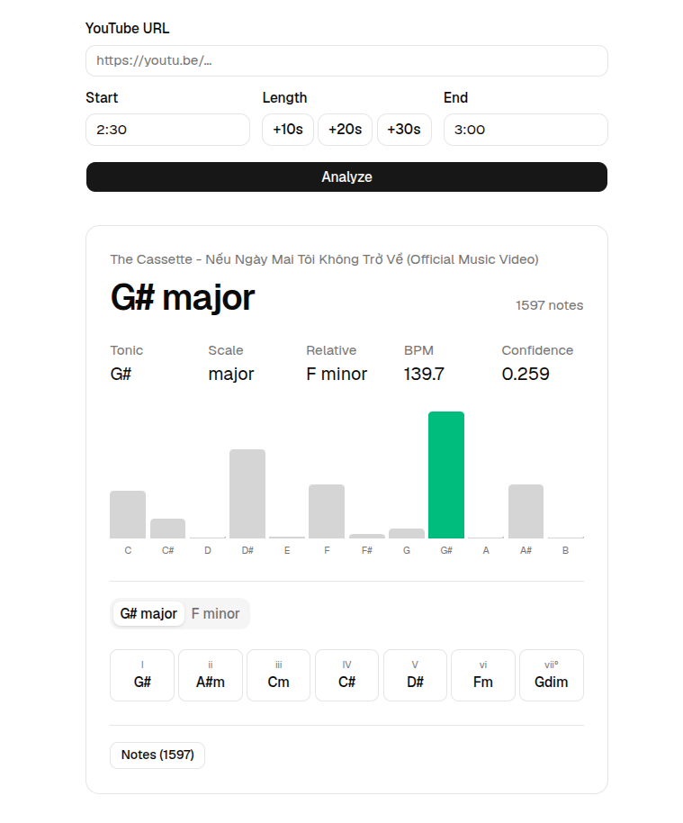

# Scallym

Identify a song's key, tonic, and scale from a YouTube clip.

Paste a link and a start/end timestamp (30s max).

- The server pulls that segment with `yt-dlp`
- Transcribes it to notes with [basic-pitch](https://github.com/spotify/basic-pitch-ts)
- Derives the key with the Krumhansl-Schmuckler algorithm
- Estimates tempo with [music-tempo](https://github.com/killercrush/music-tempo)

Results (and the transcribed MIDI) are stored in MongoDB, which doubles as a cache.

Transcription is CPU-bound and runs synchronously: expect ~60s for a 30s clip.



## Dependencies

- MongoDB: [https://cloud.mongodb.com](https://cloud.mongodb.com/v2/641ef4f00b87b2032fd27049#/clusters)
- Audio processing tools: `yt-dlp` and `ffmpeg`

## Self-hosting

The `compose.yaml` runs the app and its own MongoDB, so no Atlas account or IP allowlist is involved:

```sh
docker compose up -d --build   # http://localhost:3000
```

Run it somewhere with a **residential IP**. YouTube bot-checks datacenter ranges, so `yt-dlp` fails from most cloud hosts, which also rules out Vercel, along with its function time limit (an analysis takes ~60s).

Note that `yt-dlp` breaks whenever YouTube changes; rebuild the image to pick up a newer
release.
